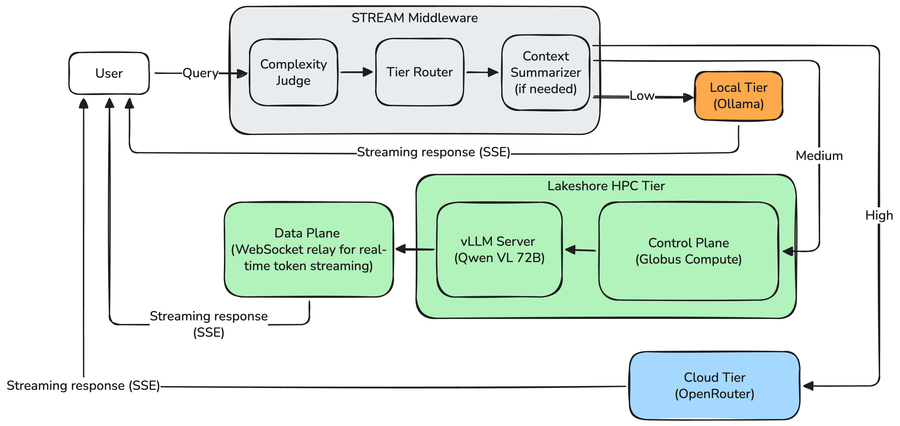

# STREAM: Multi-Tier LLM Inference Middleware

**Smart Tiered Routing Engine for AI Models**

STREAM unifies local device inference, campus HPC inference, and commercial cloud inference behind a single OpenAI-compatible API with automatic complexity-based routing and real-time token streaming from all tiers.

<p align="center">
  
</p>

## Key Features

- **Three-tier routing**: Automatically routes queries to the cheapest capable tier based on complexity
  - **Local** (Ollama) — free, private, instant response
  - **Campus HPC** (Globus Compute + vLLM) — free GPU inference on institutional clusters
  - **Cloud** (500+ models via OpenRouter) — frontier models when needed
- **Dual-channel HPC streaming**: Novel architecture that separates Globus Compute's control plane from a WebSocket relay data plane, enabling sub-second time-to-first-token from HPC
- **Tier-aware context summarization**: Differential rolling summarization per tier prevents long conversations from forcing unnecessary tier upgrades
- **Two deployment modes**: Docker Compose server (multi-user) and standalone desktop app (single-user), sharing 90%+ of the codebase
- **OpenAI-compatible API**: Drop-in replacement for existing tools and workflows
- **Multimodal support**: Vision-language routing across all three tiers

## Architecture

STREAM classifies each query as LOW, MEDIUM, or HIGH complexity using a local LLM-as-judge, routes it to the cheapest capable tier, applies tier-aware context summarization if needed, and streams the response back via SSE.

The **dual-channel streaming architecture** is the key innovation for HPC inference: Globus Compute handles authentication and job dispatch (control plane), while a lightweight WebSocket relay delivers tokens in real-time (data plane). Both sides connect outbound to the relay, requiring no firewall changes on HPC nodes or user devices.

## Three Inference Tiers

| Tier | Model | Hardware | Context | Cost |
|------|-------|----------|---------|------|
| Local | Llama 3.2 3B / Gemma 3 4B (VL) | CPU / Apple Silicon | 32K | $0 |
| HPC (Lakeshore) | Qwen 2.5-VL 72B-AWQ | H100 NVL 94 GB | 64K | $0 |
| Cloud | 500+ models via OpenRouter | Provider-managed | 64K-1M | $$$ |

## Prerequisites

- **Python 3.11+**
- **[Ollama](https://ollama.ai)** — for local model inference
- **Node.js 18+** — for building the React frontend
- **Docker** (server mode only)

## Quick Start

### Desktop Mode (Single User)

```bash
# Clone the repo
git clone https://github.com/uicacer/STREAM.git
cd STREAM

# Install Ollama and pull required models
ollama pull llama3.2:3b
ollama pull gemma3:4b

# Install Python dependencies
pip install -e .

# Build the frontend
cd frontends/react && npm install && npm run build && cd ../..

# Run (opens a native window with the chat UI)
python -m stream.desktop.main
```

### Server Mode (Docker Compose)

```bash
# Clone and configure
git clone https://github.com/uicacer/STREAM.git
cd STREAM
cp .env.example .env  # Edit with your API keys

# Start all services
docker compose up -d
```

The UI is available at `http://localhost:5000`.

### Optional Setup

- **Cloud tier**: Add your OpenRouter API key in the UI settings panel (get one free at [openrouter.ai/keys](https://openrouter.ai/keys))
- **Lakeshore HPC tier**: Requires UIC Lakeshore cluster access and Globus Compute authentication (click "Authenticate with Globus" in the UI)

See the [Setup Guide](docs/SETUP_GUIDE.md) for detailed step-by-step instructions.

## Demo

[](https://youtu.be/sPcUh9df3YE)

## Tech Stack

- **Backend**: Python 3.11+, FastAPI, LiteLLM, Globus Compute
- **Frontend**: React 18 + TypeScript, Vite, Zustand, Tailwind CSS
- **HPC**: vLLM, Apptainer, NVIDIA H100
- **Infrastructure**: Docker Compose, PostgreSQL/SQLite, WebSocket relay

## Publication

> **STREAM: Multi-Tier LLM Inference Middleware with Dual-Channel HPC Token Streaming**
> Anas Nassar, Steve Mohr, Leonard Apanasevich, Himanshu Sharma
> PEARC '26: Practice and Experience in Advanced Research Computing, July 2026

## License

Apache License 2.0. See [LICENSE](LICENSE) for details.

## Author

Anas Nassar (nassar@uic.edu) — Advanced Cyberinfrastructure for Education and Research (ACER), University of Illinois Chicago
